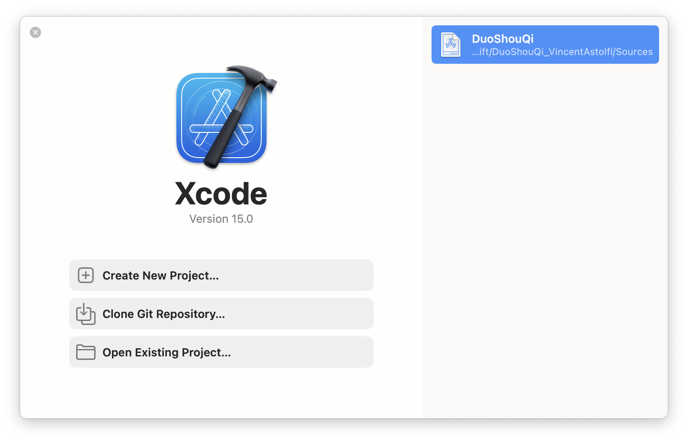
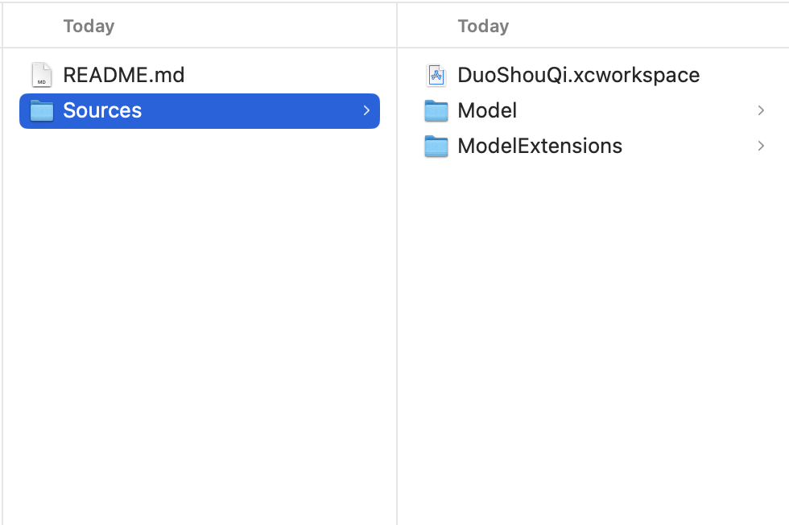
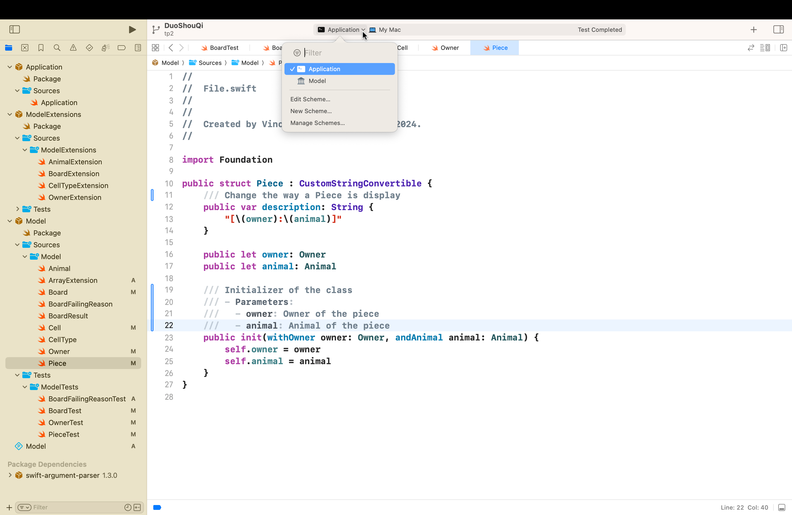
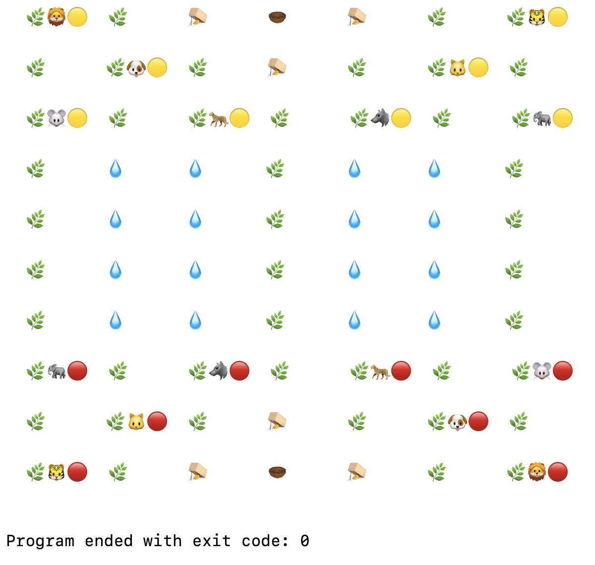
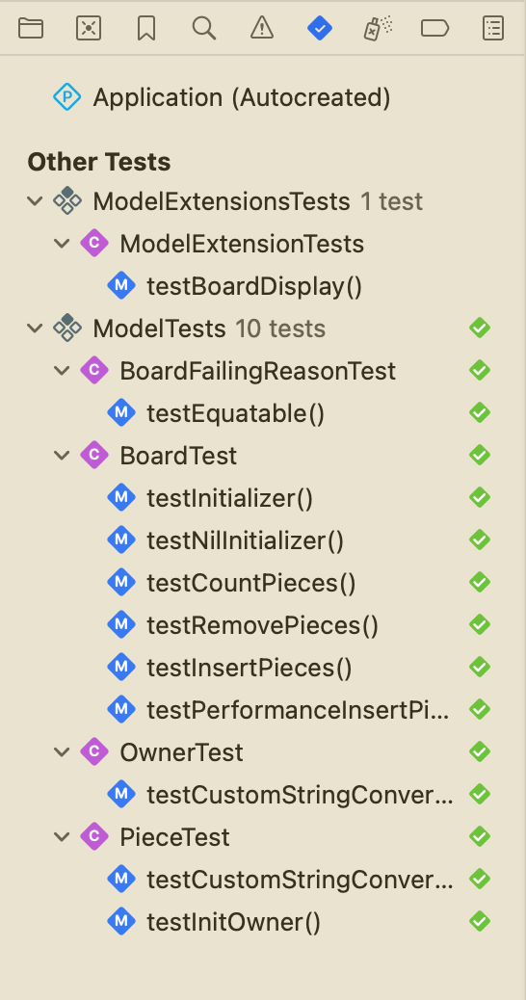
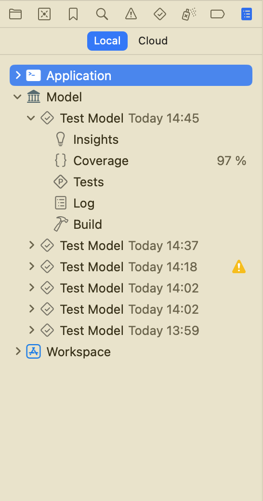
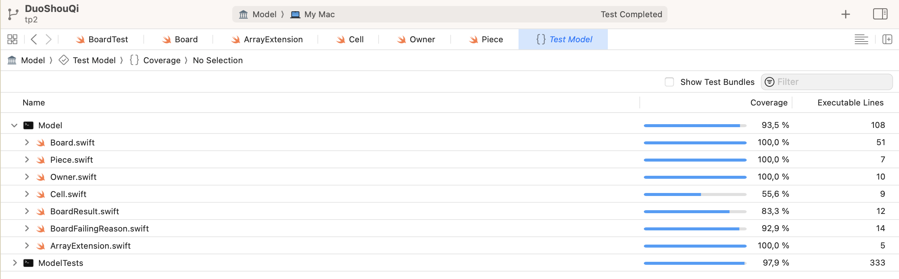

# DuoShouQi_VincentAstolfi

## Summary 

- Run application and test
- Get code coverage
- Play the game
- Game basic rules

Poject made during the Swift module during my 3rd year at the IUT informatique d'Aubière.

**The subject of this project and the rules of the DouShouQi games can be find here**

https://codefirst.iut.uca.fr/git/mchSamples_Apple/DouShouQi

### Using Xcode

#### Running Application 

- Clone the repository using : 
```shell
git clone https://codefirst.iut.uca.fr/git/vincent.astolfi/DuoShouQi_VincentAstolfi.git
```

- Open Xcode then select open an existing project



- Click on the workspace folder in Sources



- In Xcode, you can now choose the project you want to start



If you choose `Application` and then run it you will see the Board that is create as it is in the example. 



You can also choose the Tests package to run them. I've create some test that don't cover all the code but a part of them.

#### Running Test

If you select `Model` as your starting project and then run it you will run all the UnitTest of the Model package

You could also run them by going to the special Xcode section for the test on the top left corner of your screen



Then you can see the code coverage of the project in the Xcode section



You can also get more detail on the code coverage by clicking on the `Coverage`



### Using the terminal

#### Running Test

- Clone the repository using : 
```shell
git clone https://codefirst.iut.uca.fr/git/vincent.astolfi/DuoShouQi_VincentAstolfi.git
```

- Go in the sources folder :

```shell
cd Sources
```

- To get all the runnable project type :

```shell
xcodebuild -list
```

- To run test type :

```shell
xcodebuild test -scheme *TestPackage*
```

The actual possible test package are :

    ModelExtensionsTests,
    ModelTests

### How to play the game

You can play the game with very simple rules and two types of player

Go to your `Application.swift` file on your `Application` package.

#### Create rules and board

```swift
// create the rules and the board
var rules = VerySimpleRules()
guard var board = VerySimpleRules.createBoard() else {
    return
}
```

Change those lines to change the rules you want to play with and the associate board.

At the moment, the possible rules set are :
- VerySimpleRules

#### Create the players 

```swift
// Define the different player
let player1 = RandomPlayer(withId: .player1, andName: "Lucas")!
let player2 = HumanPlayer(withId: .player2, andName: "Vincent", andInputMethod: (getInputWithKeyboard))!
```

Change those lines to change the players you want to play with.

At the moment, the possible players are :
- HumanPlayer
- RandomPlayer

##### RandomPlayer

Random player move by choosing a random move in all its possible ones

##### HumanPlayer

Human player can have different ways to move. To choose the way the player will move, you can use one of the available input type function in the `InputsType` folder in your `application` package. Just change the `andInputMethod:` parameter with the name of the function you want to use.

At the moment, the different possible inputs types are :
- getInputWithKeyboard => player enter the coordonate for the origin and the destination of the move

#### Game basic rules

The game basic rules are the same whatever the rules you choose to play in.

- To win you can : 
     - Reach the opposite player den
     - Eat all the opposite player pieces
     - Force the opposite player to have no move left

- Game loop :
     - The player move
     - The game check if the move is winning
     - If it is, we left the game loop and display the winner
     - Else, we change the player to the other one and repeat this loop